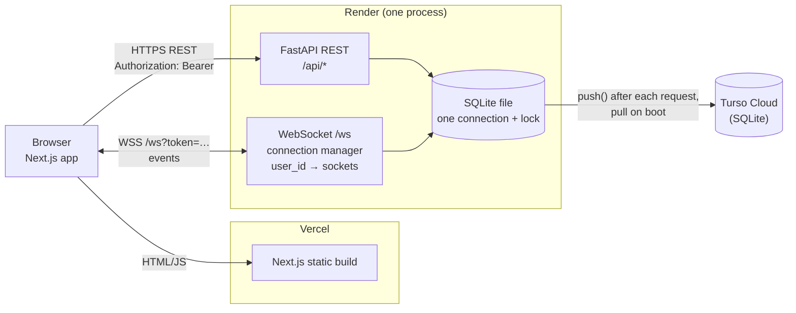
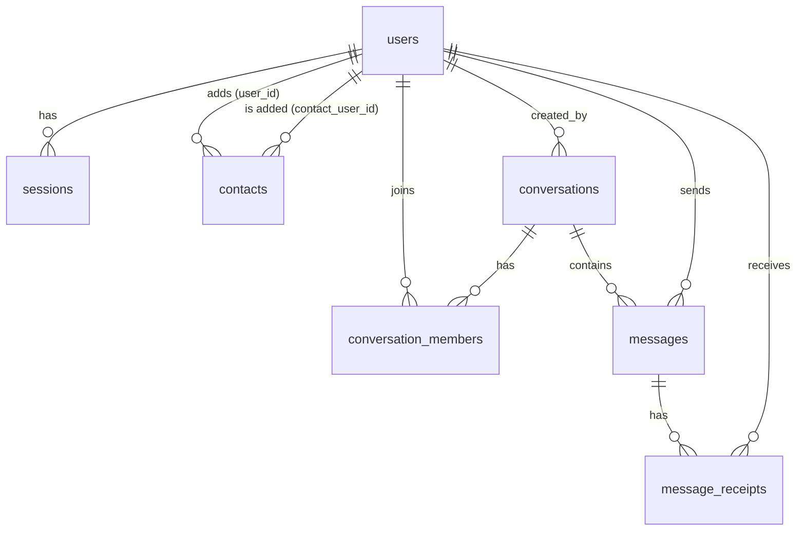

# Signal Clone

A Signal Desktop-style messaging web app: phone-number sign-in with a mock code, a contact list, real-time one-to-one and group chat with typing indicators, presence and sending/sent/delivered/read ticks, and group admin controls. The frontend is Next.js + TypeScript, the backend is FastAPI with plain SQL on SQLite, and live updates go over a single WebSocket per browser tab. All messages are stored in the database before anyone is told they were sent, so an offline recipient never misses one.

> Encryption is **simulated**. Messages are stored as plain text on the server. The app does not implement end-to-end encryption and the UI says so.

## Live demo

| | URL |
|---|---|
| Frontend (Vercel) | https://signal-clone-pied.vercel.app |
| Backend (Render) | https://signal-clone-api-1q9d.onrender.com (health: `/api/health`) |

The backend runs on Render's free tier, which sleeps after about 15 minutes without traffic. The first request after that can take about a minute. **Open https://signal-clone-api-1q9d.onrender.com/api/health first** and wait for `{"status":"ok"}`, then open the frontend.

## Demo accounts

Sign in with any of these numbers. The verification code is always **`123456`** (mock, no SMS is sent). Any other valid number creates a new account and asks for a name and optional photo.

| Phone | Name | What it shows |
|---|---|---|
| +15550000001 | Alice Johnson | Main demo account. Chat with Bob (all read), chat with Carol (**2 unread**), admin of the group **Weekend Hike** (**1 unread**). |
| +15550000002 | Bob Smith | Chat with Alice, member of Weekend Hike. His latest group message shows *delivered* (not everyone has read it). |
| +15550000003 | Carol Diaz | Chat with Alice, member of Weekend Hike (**2 unread**). |
| +15550000004 | Dave Patel | Member of Weekend Hike only; no direct chats. |
| +15550000005 | Eve Moreau | Nobody's contact and in no chats. Find her via New chat search, then "Add contact" or start a chat. |

Alice, Bob, Carol and Dave all have each other as contacts. To try real-time features, open two different browsers (or a normal and a private window) and log in as two users. Tabs of the same browser share one login (the token is in `localStorage`).

## Features

**Authentication**
- Register / log in with a phone number and a mock 6-digit code (`123456`); one flow for both.
- New users set a display name (first + last) and an optional profile photo.
- Session survives refresh; logout deletes the session on the server.

**Contacts and conversation list**
- Conversations sorted by most recent activity, with last-message preview (`You:` / `Sender:` prefixes), time, and unread badge.
- Search the list by chat name or last message; New chat searches all users by name or phone number.
- Add a contact; open (or reuse) a direct chat with anyone.
- Online dot and "Online" / "Last seen 5 min ago" in the chat header.

**One-to-one messaging**
- Real-time send and receive, also across several tabs of the same user.
- Message timestamps, day separators ("Today", "Yesterday", date), Signal-style grouped bubbles.
- Statuses: sending (dashed circle), sent (one check), delivered (two checks), read (two checks on a filled badge); failed sends show "Not sent" and can be retried.
- Typing indicator in the chat and in the list.
- Messages persist across refresh, reconnect and backend restarts; offline users receive them on reconnect. Retries never create duplicates.

**Groups**
- Create a group with a name and members (creator becomes admin).
- Group messaging with per-member delivery/read state (ticks show the lowest status across members).
- Group info: member list with roles and online dots.
- Admins add and remove members; anyone can leave. Enforced by the backend (403 for non-admins). If the last admin leaves, the longest-standing member is promoted.
- Removed members lose access to history and sending immediately.

**Signal experience**
- Signal Desktop layout: nav rail, conversation list, chat pane; Signal's colors, bubbles and ticks.
- Native modal dialogs (New chat, New group, Add members, Group info, Safety number), toasts for events and errors.
- Settings: working Profile (name and photo), placeholder Privacy / Notifications / Appearance / Linked devices sections, Log out.

**Placeholders (allowed by the assignment)**
- Calls and Stories tabs show "Coming soon"; video/voice call buttons show a toast.
- Mock encryption notice in every chat and a mock "safety number" dialog for direct chats, both clearly labeled as not real encryption.

Bonus features (attachments, reactions, reply/quote, disappearing messages, dark mode, responsive layout, keyboard shortcuts) are **not** implemented.

## Tech stack

| Layer | Choice | Why |
|---|---|---|
| Frontend | Next.js 16 (App Router), React 19, TypeScript | Required stack. Plain React state; the app state is small enough that no state library is needed. |
| Styling | CSS Modules, `lucide-react` icons | Scoped hand-written CSS to match Signal's look closely; one icon library. |
| Backend | FastAPI, uvicorn | Required stack. Async WebSockets and sync REST handlers in one process. |
| Database | SQLite via `pyturso`, plain parameterized SQL (no ORM) | Required SQLite. Raw SQL keeps every query visible. `pyturso` is sqlite3-compatible and can sync to Turso Cloud. |
| Real-time | Native WebSocket, one in-memory connection manager | Simplest correct design for a single server process. |
| Tests | pytest + FastAPI `TestClient` | 44 backend tests covering auth, schema, messaging, receipts, groups and WebSocket behavior. |
| Hosting | Vercel (frontend), Render free (backend), Turso Cloud free (database) | All free; see [Deployment](#deployment). |

## Architecture overview



- **REST vs WebSocket.** REST handles everything request-shaped: login, profile, search, contacts, the conversation list, message history, creating chats/groups and membership changes. The WebSocket carries everything live: sending messages (`message:send`), delivery and read acknowledgements, typing, presence, and "something changed, reload" notifications. List-shaped state (previews, order, unread counts, presence) is always re-fetched from `GET /api/conversations` after an event rather than patched in the browser, so it stays derived from the database.
- **One shared DB connection behind a global lock.** `pyturso` fails with "database is locked" under concurrent connections and has no busy-timeout, so the backend opens a single connection at startup and every DB operation takes a `threading.Lock`. WebSocket handlers and the async REST handlers run their DB work in a thread (`run_in_threadpool`) so waiting for the lock never blocks the event loop; WebSocket pushes happen only after the transaction committed and the lock is released.
- **Persistence in production.** Render's free disk is temporary. `pyturso` keeps a local SQLite file and syncs it with Turso Cloud: it downloads the database on boot and pushes local changes after every request, before the response is sent. A client therefore only sees success once the write is in the cloud.
- **In-memory connection manager.** `websocket.py` keeps `dict[user_id, set[WebSocket]]` (one socket per tab). `send_to(user_ids, event)` fans an event out to every open socket of those users. This only works within one backend process; several instances would need shared pub/sub (for example Redis).

## Message lifecycle

What happens when Alice sends "hi" to Bob, exactly as implemented:

1. **sending** (browser only). The composer creates a pending bubble with a new `client_id = crypto.randomUUID()` and sends `message:send {conversation_id, content, client_id}`. The event stays in an in-memory outbox until it is acked or rejected, and the whole outbox is resent (same `client_id`) every time the socket reconnects.
2. **Validate and persist (one transaction).** The server checks Alice is a member (otherwise an `error` event "Conversation not found"), strips the content and checks 1-4000 characters. Then, in one transaction: insert the message with `INSERT ... ON CONFLICT(sender_id, client_id) DO NOTHING`, insert one `message_receipts` row with status `sent` for every other current member, and set `conversations.updated_at` to the message's `created_at`. If the insert hit the unique constraint, it is a retry: nothing is written and the existing message is returned.
3. **sent.** Only after the commit (and the Turso push in production) does the server reply `message:ack {client_id, message}` to the sending socket. The browser replaces the pending bubble by `client_id`; the message now shows one check.
4. **Broadcast.** For a new message (not a retry) the server pushes `message:new {message}` to every member's open sockets, including Alice's other tabs, skipping the socket that sent it. Offline members get nothing now; the message is already in the database.
5. **delivered.** Bob's client answers `message:new` with `message:delivered {message_ids: [id]}`. A push alone never counts as delivered. For messages that arrived while Bob was offline, after (re)connecting and loading the conversation list his client sends `message:delivered {up_to_id}` with the newest message id it saw. Both only update Bob's own receipts and only `WHERE status = 'sent'`, so a status never moves backwards.
6. **read.** When Bob has the chat open and the tab is visible, his client sends `conversation:read {conversation_id}`. In one transaction the server moves his read cursor (`conversation_members.last_read_message_id`) forward to the conversation's newest message id, then sets his receipts up to the cursor to `read` (`WHERE status != 'read'`). His tabs get `conversation:read` back and reload the list, so the unread badge clears everywhere.
7. **Ticks to the sender.** After any receipt change the server recomputes the affected messages' status and pushes one `receipt:update {messages: [{id, conversation_id, status}]}` per sender. The status of a message is the **lowest receipt status across its recipients** (`sent < delivered < read`), computed in SQL. In a direct chat that is simply the other person's status; in a group a message shows *read* only when every member has read it.

Unread count = messages in the conversation with `id > my last_read_message_id` that I did not send. Fetching history (`GET /messages`) never marks anything read.

## Database schema

Seven tables, defined in `backend/app/database.py` and created on startup (`CREATE TABLE IF NOT EXISTS`). Foreign keys are enforced (`PRAGMA foreign_keys = ON`). All timestamps are ISO-8601 UTC strings with a trailing `Z` (e.g. `2026-10-09T10:00:00Z`), set by the database.



**users**
| Column | Type | Notes |
|---|---|---|
| id | INTEGER | PK AUTOINCREMENT |
| username | TEXT | UNIQUE, nullable. Unused by the app (phone-only sign-in) |
| phone | TEXT | UNIQUE, normalized `+<digits>` |
| display_name | TEXT | NOT NULL |
| avatar_url | TEXT | nullable; a small `data:image/...` URL |
| last_seen_at | TEXT | nullable; written when the user's last socket closes |
| created_at | TEXT | NOT NULL, default now |
| | | CHECK (username IS NOT NULL OR phone IS NOT NULL) |

**sessions**
| Column | Type | Notes |
|---|---|---|
| id | INTEGER | PK AUTOINCREMENT |
| user_id | INTEGER | NOT NULL, FK → users ON DELETE CASCADE |
| token_hash | TEXT | NOT NULL UNIQUE; SHA-256 of the token (the raw token is never stored) |
| created_at | TEXT | NOT NULL, default now |

**contacts** (one-way: "user_id has contact_user_id in their contacts")
| Column | Type | Notes |
|---|---|---|
| user_id | INTEGER | NOT NULL, FK → users ON DELETE CASCADE |
| contact_user_id | INTEGER | NOT NULL, FK → users ON DELETE CASCADE |
| created_at | TEXT | NOT NULL, default now |
| | | PK (user_id, contact_user_id); CHECK (user_id != contact_user_id) |

**conversations** (both direct and group chats)
| Column | Type | Notes |
|---|---|---|
| id | INTEGER | PK AUTOINCREMENT |
| type | TEXT | NOT NULL, CHECK IN ('direct', 'group') |
| name | TEXT | group name; NULL for direct chats |
| direct_key | TEXT | UNIQUE; `"<smaller user id>:<larger user id>"` for direct chats, NULL for groups |
| created_by | INTEGER | NOT NULL, FK → users |
| created_at | TEXT | NOT NULL, default now |
| updated_at | TEXT | NOT NULL, default now; set to the latest message time (list order) |
| | | CHECK ((type = 'direct' AND direct_key IS NOT NULL) OR (type = 'group' AND name IS NOT NULL)) |

**conversation_members**
| Column | Type | Notes |
|---|---|---|
| conversation_id | INTEGER | NOT NULL, FK → conversations ON DELETE CASCADE |
| user_id | INTEGER | NOT NULL, FK → users ON DELETE CASCADE |
| role | TEXT | NOT NULL default 'member', CHECK IN ('admin', 'member') |
| joined_at | TEXT | NOT NULL, default now |
| last_read_message_id | INTEGER | NOT NULL default 0; the read cursor |
| | | PK (conversation_id, user_id); INDEX `idx_members_user (user_id)` |

**messages**
| Column | Type | Notes |
|---|---|---|
| id | INTEGER | PK AUTOINCREMENT; the only ordering used anywhere |
| conversation_id | INTEGER | NOT NULL, FK → conversations ON DELETE CASCADE |
| sender_id | INTEGER | NOT NULL, FK → users |
| client_id | TEXT | NOT NULL; client-generated UUID |
| content | TEXT | NOT NULL, CHECK (length(content) > 0) |
| created_at | TEXT | NOT NULL, default now (display only) |
| | | UNIQUE (sender_id, client_id); INDEX `idx_messages_conversation (conversation_id, id)` |

**message_receipts** (one row per message per recipient; the sender has none)
| Column | Type | Notes |
|---|---|---|
| message_id | INTEGER | NOT NULL, FK → messages ON DELETE CASCADE |
| user_id | INTEGER | NOT NULL, FK → users ON DELETE CASCADE |
| status | TEXT | NOT NULL default 'sent', CHECK IN ('sent', 'delivered', 'read') |
| delivered_at | TEXT | nullable |
| read_at | TEXT | nullable |
| | | PK (message_id, user_id); INDEX `idx_receipts_user_status (user_id, status)` |

Key design choices:
- **One `conversations` table + `conversation_members` for both chat types.** Membership checks, history, sending and unread counts use one code path; `type` covers the few differences.
- **Per-recipient receipts.** A single status column on `messages` can't say "Bob read it, Carol hasn't". The sender's ticks are the minimum over the receipts.
- **`direct_key` UNIQUE** guarantees one direct chat per pair, even if both people start a chat at the same moment: the insert uses `ON CONFLICT(direct_key) DO NOTHING` and then selects the existing row.
- **`UNIQUE(sender_id, client_id)`** makes message retries idempotent at the database level.
- **AUTOINCREMENT ids as ordering.** Ids strictly increase and are never reused, so history order, "latest message", the read cursor and the delivered catch-up (`up_to_id`) all compare ids, never timestamps. (Ids can have gaps; that is harmless.)
- **CHECK constraints and enforced foreign keys** reject invalid data whatever code path writes it.
- **Derived state.** No denormalized counters: last message = `MAX(id)`, unread = ids above the cursor, ticks = minimum receipt status. The whole conversation list is one SQL query.

## API overview

All REST paths are under `/api`. Authenticated endpoints need `Authorization: Bearer <token>` and return **401** without a valid session. Errors are FastAPI's `{"detail": "..."}`; invalid bodies return **422**.

### REST

| Method | Path | Auth | Purpose | Key errors |
|---|---|---|---|---|
| GET | `/api/health` | no | Runs `SELECT 1`; used by Render's health check | |
| POST | `/api/auth/request-code` | no | `{phone}` → `{phone}` normalized. Mock: no SMS is sent | 422 invalid number |
| POST | `/api/auth/verify` | no | `{phone, otp}` → `{token, is_new, user}`. Logs in, or registers an unknown number | 400 wrong code |
| POST | `/api/auth/logout` | token | Deletes the session | always 204 |
| GET | `/api/me` | yes | Current user | |
| PATCH | `/api/me` | yes | `{display_name?, avatar_url?}`; `avatar_url: null` removes the photo | 422 name not 1-50 chars, avatar not a PNG/JPEG/WebP data URL ≤ 200 KB |
| GET | `/api/users/search?q=` | yes | People by name substring or phone digits, contacts first, max 20, never yourself; `[]` if `q` < 2 chars | |
| GET | `/api/contacts` | yes | My contacts (`Person` = user + `is_contact`) | |
| POST | `/api/contacts` | yes | `{user_id}` → add contact (idempotent) | 400 yourself, 404 unknown user |
| GET | `/api/conversations` | yes | My chats with name, avatar, presence (direct), member count, unread count, last message (preview ≤ 100 chars); newest activity first | |
| POST | `/api/conversations/direct` | yes | `{user_id}` → existing or new direct chat. Pushes `conversation:new` if created | 400 yourself, 404 unknown user |
| POST | `/api/conversations/groups` | yes | `{name, member_ids}` → new group, creator is admin, one transaction. Pushes `conversation:new` | 400 no other members, 404 unknown user, 422 name not 1-50 chars |
| GET | `/api/conversations/{id}/messages` | member | Full history, oldest first; `status` set on my own messages | 404 not a member |
| GET | `/api/conversations/{id}/members` | member | Members with role and online flag, admins first | 404 not a member |
| POST | `/api/conversations/{id}/members` | admin | `{user_ids}` → add members (existing ones skipped); returns the member list. Pushes `member:update` | 404 not a member / unknown user, 400 direct chat, 403 not admin |
| DELETE | `/api/conversations/{id}/members/{user_id}` | admin, or self | Remove a member, or leave (own id). Pushes `member:update` and `receipt:update` | 404 not a member / target not a member, 400 direct chat, 403 not admin |

### WebSocket: `GET /ws?token=<session token>`

Every client event is JSON with a `type`. Any user or sender id inside a client event is ignored; identity comes only from the socket's session. Invalid events get an `error` reply and the socket stays open.

| Direction | Type | Payload | Notes |
|---|---|---|---|
| C → S | `message:send` | `conversation_id, content, client_id` | Validate, persist, ack, broadcast |
| S → C | `message:ack` | `client_id, message` | To the sending socket only; `message` has the history shape |
| S → C | `message:new` | `message` | To all members' sockets except the sending one; not sent for retries |
| C → S | `message:delivered` | `message_ids?: int[]`, `up_to_id?: int` | Live ack of `message:new`, or catch-up after reconnect |
| C → S | `conversation:read` | `conversation_id` | Move my read cursor to the newest message |
| S → C | `conversation:read` | `conversation_id` | To all my sockets when the read changed something; they reload the list |
| S → C | `receipt:update` | `messages: [{id, conversation_id, status}]` | To the sender; `status` is the aggregated tick status |
| C → S | `typing:start` / `typing:stop` | `conversation_id` | Membership checked; nothing stored |
| S → C | `typing:start` / `typing:stop` | `conversation_id, user_id` | To the other members |
| S → C | `presence:update` | `user_id, online, last_seen_at` | When a user's first socket opens / last socket closes; sent to people who share a chat |
| S → C | `conversation:new` | `conversation_id` | A chat I'm in was created; reload the list |
| S → C | `member:update` | `conversation_id, actor_id, added_user_ids?` or `removed_user_id?` | Group membership changed (also sent to the removed user); reload |
| S → C | `error` | `client_id \| null, detail` | e.g. "Conversation not found", "Message is empty" |

Close code **4401** means the token is invalid; the client then clears it and goes to the login screen instead of reconnecting. Other closes reconnect with exponential backoff (1 s, 2 s, 4 s, 8 s, then every 10 s); on every reconnect the client re-fetches the list and open chat, resends its outbox and sends the delivered catch-up and read.

## Authentication and authorization

- **Mock OTP.** `POST /auth/request-code` only validates and normalizes the phone number. `POST /auth/verify` accepts the fixed code `123456`, creates the user if the number is new (`is_new: true` sends the client to the profile step), and creates a session. Register and login are one flow, so the API never reveals whether a number is registered.
- **Server-side sessions.** The token is 32 random bytes (`secrets.token_urlsafe`); only its SHA-256 hash is stored in `sessions`, so a leaked database contains no usable tokens. Logout deletes the row. JWTs were not used because they can't be revoked without a blocklist.
- **Bearer header, not cookies.** The frontend (Vercel) and backend (Render) are on different sites, where cookies are fragile. The token is kept in `localStorage` and sent as `Authorization: Bearer`. Because no cookies are involved, CORS allows any origin without exposing anything.
- **WebSocket auth.** Browsers can't set headers on a WebSocket, so the token goes in the query string. The server validates it before registering the socket and closes with 4401 if invalid. To keep tokens out of logs, uvicorn runs with `--no-access-log` and a logging filter in `app/main.py` rewrites `token=...` to `token=[redacted]` in uvicorn's WebSocket handshake lines.
- **Identity only from the session.** `get_current_user` (REST) and `user_for_token` (WebSocket) are the only sources of "who is calling"; no endpoint or event trusts a user id from the client.
- **Membership checks.** Every conversation read or write (history, members, sending, typing, read) checks `conversation_members`. Non-members get **404**, the same as for a conversation that doesn't exist, so ids can't be probed.
- **Admin checks.** Adding members, and removing anyone other than yourself, require `role = 'admin'` in that group: **403** otherwise. Hidden buttons in the UI are only for convenience.

## Local setup

Prerequisites: **Python 3.13**, **Node.js 20.9+** (developed with Node 25) and npm.

### Backend

```bash
cd backend
python3.13 -m venv .venv          # or: uv venv --python 3.13
source .venv/bin/activate
pip install -r requirements.txt   # or: uv pip install -r requirements.txt
python seed.py                    # creates backend/signal.db with the demo data
uvicorn app.main:app --reload --no-access-log
```

The API runs at http://localhost:8000 (interactive docs at http://localhost:8000/docs). With no Turso variables set, it uses a plain local SQLite file.

### Frontend

```bash
cd frontend
npm install
cp .env.example .env.local        # NEXT_PUBLIC_API_URL=http://localhost:8000
npm run dev
```

Open http://localhost:3000 and log in with a demo account (code `123456`).

### Tests

```bash
cd backend
pytest
```

Each test uses a fresh temporary SQLite file; no setup or running server is needed.

### Reset the demo data

```bash
cd backend
python seed.py --reset
```

Stop the backend first: `pyturso` locks the database file to one process. Without `--reset`, `seed.py` does nothing if users already exist (that's why it is safe to run on every production start).

## Environment variables

| Variable | Where | Default | Purpose |
|---|---|---|---|
| `DB_PATH` | backend | `backend/signal.db` | Path of the SQLite file |
| `TURSO_DATABASE_URL` | backend | unset | Turso database URL (`libsql://...`). When set, the local file is synced with Turso Cloud |
| `TURSO_AUTH_TOKEN` | backend | unset | Turso auth token for that database |
| `NEXT_PUBLIC_API_URL` | frontend | `http://localhost:8000` | Backend base URL. The WebSocket URL is derived from it (`http` → `ws`, `https` → `wss`). Baked in at build time |

See `backend/.env.example` and `frontend/.env.example`. The backend does not load `.env` by itself: use `uvicorn ... --env-file .env` or export the variables in your shell.

## Deployment

1. **Turso.** Create a database (`turso db create signal-clone`), then get its URL (`turso db show signal-clone --url`) and a token (`turso db tokens create signal-clone`).
2. **Render (backend).** New Blueprint from this repo; `render.yaml` defines one free Python web service with root `backend`, build `pip install -r requirements.txt`, start `python seed.py && uvicorn app.main:app --host 0.0.0.0 --port $PORT --no-access-log`, health check `/api/health` and Python 3.13. Set `TURSO_DATABASE_URL` and `TURSO_AUTH_TOKEN` in the dashboard. On first start the seed creates the demo data; later starts leave existing data alone.
3. **Vercel (frontend).** Import the repo with root directory `frontend` (Next.js preset) and set `NEXT_PUBLIC_API_URL` to the Render URL (`https://...onrender.com`). Redeploy after changing it, because it is baked into the build.

Why this split:
- **Not Vercel for the backend.** Vercel Functions have no persistent filesystem for a SQLite file, and WebSocket connections there are spread over instances with time limits, which breaks the in-memory connection manager.
- **Why Turso.** Free hosts that run a long-lived WebSocket process (Render free) have temporary disks, so a plain SQLite file would be wiped on every restart, sleep or deploy. Turso is SQLite-compatible, so the schema and SQL stay pure SQLite, and `pyturso` keeps a local file in sync with it.

## Assumptions and limitations

- **No real encryption.** Messages are stored and transmitted as plain text (over HTTPS/WSS in production). The lock notice and safety-number dialog are mocks and say so.
- **Mock OTP.** Every number accepts `123456`; anyone can sign in as any number. No SMS provider.
- **Sessions never expire.** Logout revokes them; there is no `expires_at`. Tokens live in `localStorage`, so an XSS bug could read them (React escapes rendered text, which reduces that risk).
- **Phone numbers can be enumerated.** User search matches names and partial numbers and returns phone numbers.
- **Single backend process.** The WebSocket connection manager is in memory; scaling to several instances would need shared pub/sub.
- **Global DB lock.** All database work runs one operation at a time. Queries take microseconds, so it is fine for a demo, not for real load. In production every request also waits for one push to Turso.
- **Render cold starts.** The free backend sleeps after ~15 minutes idle and needs about a minute to wake. While it sleeps or redeploys, connected clients show a reconnect toast and retry.
- **Bad-token close code behind Render's proxy.** Locally an invalid WebSocket token gets close code 4401; through Render's proxy the browser sees a generic 1006 after a delay. Harmless in practice: the page checks the session with `GET /api/me` before connecting and re-fetches over REST on every reconnect, so a dead token still ends at a 401 and the login screen.
- **Delivered on catch-up** means "the client loaded the conversation list after reconnecting", not "the client downloaded every message body" (history is fetched per chat when opened).
- **Unsent messages live in memory.** Closing the tab while offline drops messages still in the outbox. There is no send timeout; a half-open connection leaves bubbles "sending" until the browser notices the drop.
- **Groups.** Members added later see the whole history (none of it counts as unread). No group avatars, no promote-to-admin action (the last admin leaving auto-promotes someone). A removed member's old messages stay in the history.
- **A direct chat appears for the other person as soon as it is opened**, before the first message (Signal waits for a message).
- **Search** filters the loaded conversation list by chat name and the last message's first 100 characters; there is no full message-history search. New chat search finds people.
- **No pagination.** A chat's full history is loaded when it is opened.
- **Presence edge cases.** On a backend restart, `last_seen_at` is not written for connections that were cut.
- **Usernames are not supported**: sign-in is phone-only (the `users.username` column exists but is unused).
- **Settings** except Profile are placeholders; read receipts, typing indicators and online status are always on.
- **Desktop only.** The layout targets desktop widths; it is not responsive.
- **Not implemented (bonus):** attachments, reactions, reply/quote, disappearing messages, dark mode, keyboard shortcuts, full-text message search.

## Project structure

```
signal-clone/
├── render.yaml                 Render Blueprint for the backend
├── backend/
│   ├── app/
│   │   ├── main.py             FastAPI app, CORS, routers, health check, token log redaction
│   │   ├── database.py         schema, single pyturso connection + lock, Turso sync
│   │   ├── auth.py             session tokens (hashing), current-user dependencies
│   │   ├── messages.py         send / history / delivered / read logic, tick aggregation
│   │   ├── websocket.py        /ws endpoint, connection manager, event handling, presence
│   │   └── routers/
│   │       ├── auth.py         request-code, verify (mock OTP), logout
│   │       ├── users.py        GET/PATCH /me
│   │       ├── contacts.py     user search, contacts
│   │       └── conversations.py  list, history, direct chats, groups, members
│   ├── seed.py                 demo users, chats and messages (idempotent; --reset)
│   ├── tests/                  pytest suite (fresh SQLite file per test)
│   └── requirements.txt
└── frontend/
    ├── app/
    │   ├── login/page.tsx      phone → code → profile onboarding
    │   ├── page.tsx            main screen: data loading, socket events, chat state
    │   └── layout.tsx, globals.css
    ├── components/             NavRail, ConversationList/Item, ChatHeader, MessageList,
    │                           MessageBubble, MessageComposer, Avatar, Dialog, NewChatDialog,
    │                           MemberPicker, PersonRow, GroupDetails, SafetyNumberDialog,
    │                           Settings, ComingSoon, Toast
    ├── lib/
    │   ├── api.ts              fetch wrapper, token storage, 401 → login
    │   ├── socket.ts           WebSocket client: reconnect, outbox, listeners
    │   ├── people.ts           contacts / user search hook
    │   ├── image.ts            avatar resize to a small JPEG data URL
    │   └── time.ts             Signal-style time formatting
    └── types/index.ts          API and WebSocket types (match the backend shapes)
```
